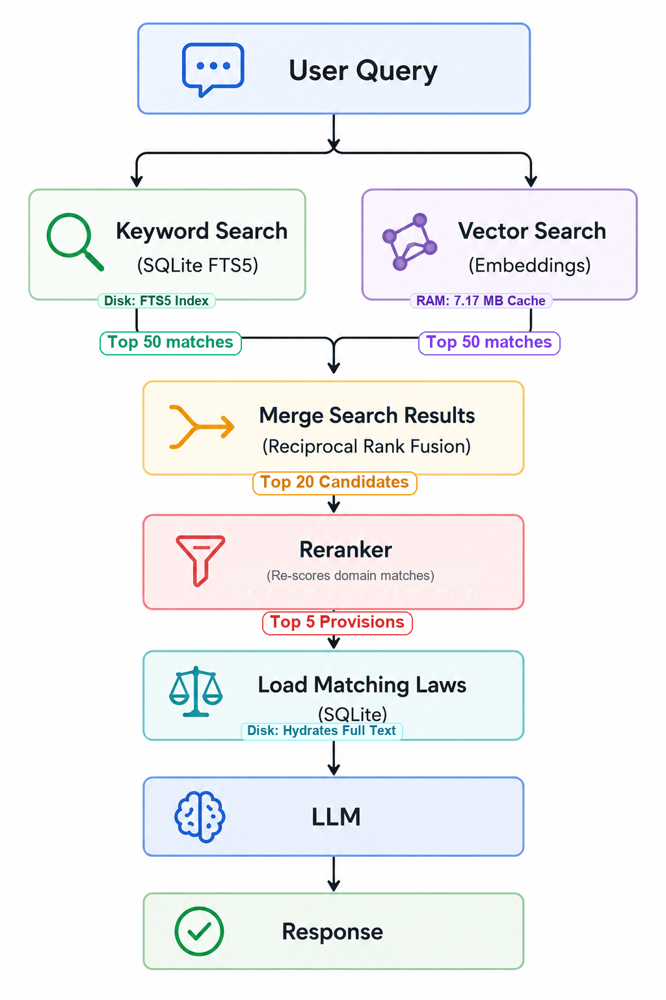
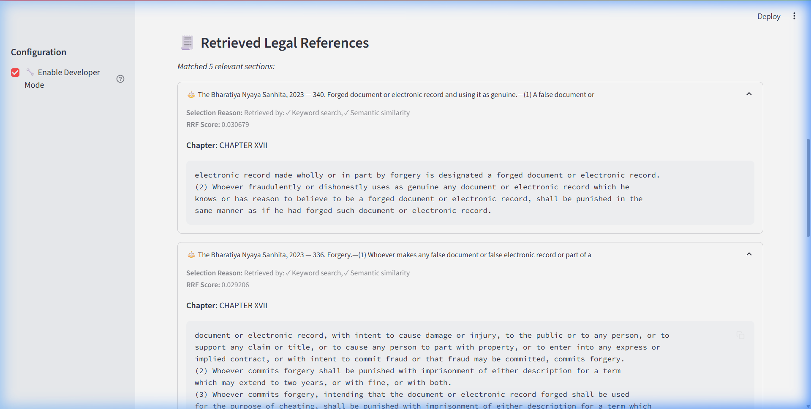
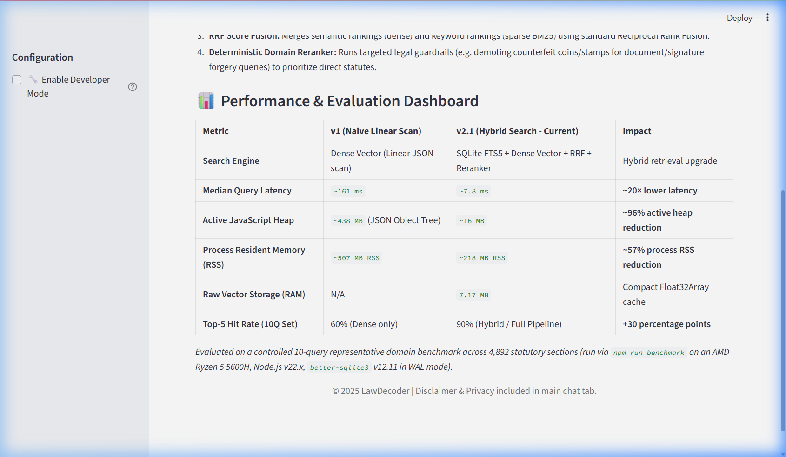

# ⚖️ LawDecoder: A Case Study in Hybrid Retrieval for Legal AI

**LawDecoder is an AI-powered legal assistant that explains Indian laws in plain language while showing the exact legal provisions used to generate each answer.**

Unlike many dense-only retrieval demos, LawDecoder focuses on retrieval quality. It combines semantic search, keyword search, Reciprocal Rank Fusion (RRF), and deterministic reranking to improve legal citation accuracy.

---

## 🚀 Features

- 🔍 **Hybrid Retrieval:** Fuses SQLite FTS5 (sparse BM25 keyword matching) and local dense vector embeddings.
- 🔀 **Reciprocal Rank Fusion (RRF):** Fuses sparse and dense search rankings to prioritize matches returned by both.
- 🎯 **Domain Reranker:** Deterministically demotes irrelevant matches (like counterfeit stamp/coin sections) and boosts direct offences (like document forgery acts) for signature queries.
- 🧾 **Citation Transparency:** Shows the exact acts, sections, and selection details for every explanation.
- 🔧 **Developer Mode:** Toggle view to inspect RRF ranks and retrieval selection reasons.
- 🤖 **Empathetic AI:** Structured legal advice (offences, punishments, safeguards) powered by Gemini 3.5 or OpenRouter fallback.
- 🖥️ **CPU/WebGPU Fallback:** Gracefully recovers to CPU extraction if ONNX WebGPU drivers are missing.

---

## 💡 Example Query & Retrieval Flow

To see the difference, consider the query: *"Someone forged my signature"*

*   **Vector-only Retrieval (Old):** Retrieves BNS Section 180 (Counterfeit coin/stamps) due to semantic proximity to "forging".
*   **LawDecoder Hybrid Retrieval (Current):**
    *   **Query:** *"Someone forged my signature"*
    *   **Top Matched References:**
        *   ✓ `BNS Section 340`: Forged document and using it as genuine
        *   ✓ `BNS Section 336`: Offence of forgery and its punishment
        *   ✓ `BNS Section 339`: Possession of forged document
        *   ✓ `BNS Section 335`: Making a false document
        *   ✓ `Bharatiya Sakshya Adhiniyam, 2023 Section 65`: Proof of signature and handwriting
    *   **LLM Explanation:** Empathy-driven summary structured under clear subheadings detailing offence implications, penalties, evidence to collect, and legal safeguards.

---

## 🧠 Why LawDecoder? (Why Dense-Only Retrieval Fails)

Most hobbyist RAG projects implement a standard pipeline: convert query to vector → query a vector DB → feed top k chunks to an LLM. While appropriate for generic tasks, this approach fails in domain-specific areas like legal research for three major reasons:

1.  **Semantic Generalization Mismatch:** Vector embeddings capture general meaning but fail to index exact terms. For example, if a user queries *"Someone forged my signature"*, semantic search retrieves counterfeit coin or Government stamp laws (`BNS Section 180`) due to proximity to the concept of "counterfeiting/forging." It misses the direct definition of forgery (`BNS Section 336`) because the word "signature" is semantically far from generic legal texts.
2.  **Duplicate Citations:** Legal codes are highly repetitive. A single query about judicial separation retrieves Section 10 of the Hindu Marriage Act, Section 23 of the Special Marriage Act, and Section 34 of the Parsi Marriage Act—all saying the exact same thing. This duplicate noise clutters the LLM context window, exhausting limits and degrading response quality.
3.  **High RAM Footprint:** Loading large law definition strings (titles, chapters, texts) along with embeddings into memory limits scalability.

---

## 🏛️ Architecture Overview

LawDecoder is built as a lightweight, performance-tuned decoupled application with a **Node.js (Express) Backend** and a **Streamlit (Python) Frontend**.



---

## 🚀 Hybrid Search Pipeline & Redesign Details

To address RAG retrieval challenges, LawDecoder implements:

### 1. SQLite + FTS5 Sparse Indexing (BM25)
All 4,892 legal sections (BNS, BNSS, IT Act, Constitution, Parsi/Hindu/Muslim personal laws) are persisted in a local **SQLite** database. A virtual **FTS5 index** handles exact-match keyword indexing (BM25 ranking), ensuring precise matches for terms like *"Section 65"*, *"forgery"*, or *"signature"*.

### 2. Lightweight Vector Memory Cache
To optimize memory, only the document IDs and compact 384-dimension `Float32Array` embedding buffers (~7.17 MB) are kept in RAM. Full text and headers are hydrated from SQLite on demand, reducing active JavaScript heap usage from **~438 MB to ~16 MB (~96% reduction)** and process resident memory (RSS) from **~507 MB to ~218 MB (~57% reduction)**.

### 3. Reciprocal Rank Fusion (RRF)
Results from keyword search (sparse index) and semantic search (dense embeddings) are merged using [Reciprocal Rank Fusion (RRF)](https://dl.acm.org/doi/10.1145/1571941.1572114), which rewards documents ranked highly by both retrieval methods.

### 4. Domain Reranker (Deterministic Guardrail)
Acts as a lightweight cross-encoder alternative. It evaluates the top 20 fused candidates from SQLite:
*   If the query is document/signature forgery-related, it **penalizes coin/stamp counterfeit sections** by 99% (`* 0.01`).
*   It **boosts direct document forgery definition and penalty sections** by 300% (`* 3.0`).
*   Deduplicates matches dynamically based on act name and content snippet.
*   *Note: In controlled ablation, the domain reranker acts as a targeted guardrail for specific statutory ambiguities (demoting counterfeit-currency false positives on signature queries) without altering aggregate recall across the wider test set.*

---

## 📊 Performance & Evaluation Dashboard

Evaluated on a controlled 10-query representative domain benchmark across 4,892 statutory sections (run via `npm run benchmark` on an AMD Ryzen 5 5600H, Node.js v22.x, `better-sqlite3` v12.11 in WAL mode):

| Metric | v1 (Naive Linear Scan) | v2.1 (Hybrid Search - Current) | Impact |
| :--- | :--- | :--- | :--- |
| **Search Engine** | Dense Vector (Linear JSON scan) | SQLite FTS5 + Dense Vector + RRF + Reranker | Hybrid precision upgrade |
| **Query Latency (Median)** | `~161 ms` | `~7.8 ms` | **~20× lower measured latency** |
| **Active JavaScript Heap** | `~438 MB` (JSON Object Tree) | `~16 MB` | **~96% active heap reduction** |
| **Process Resident Memory (RSS)** | `~507 MB RSS` | `~218 MB RSS` | **~57% process RSS reduction** |
| **Raw Vector Storage (RAM)** | N/A | `7.17 MB` | Compact Float32Array cache |
| **Top-5 Hit Rate (10Q Set)** | 60% (Dense only) | 90% (Hybrid / Full Pipeline) | **+30 percentage points** |

*Note: The latency reduction is primarily driven by replacing per-query object traversals and JSON allocations with contiguous `Float32Array` numeric loops and compiled SQLite FTS5 in C. RSS includes the Node.js runtime, native buffers, and ONNX runtime shared libraries. Accuracy was measured on a representative 10-query domain evaluation set spanning criminal law, procedure, cyber crime, family law, evidence, and consumer protection (see [evaluation_queries.md](evaluation_queries.md)).*

### Component Ablation (10-Query Benchmark)

| Retrieval Configuration | Top-5 Hit Rate | Key Behavior Observed |
| :--- | :--- | :--- |
| **Stage 1: Dense Vector Only** | 60% (6/10) | Good broad semantic coverage; confused document forgery with currency counterfeiting. |
| **Stage 2: SQLite FTS5 Only** | 70% (7/10) | Strong on exact terms and section citations; missed colloquial layman phrasing. |
| **Stage 3: Hybrid Search (RRF)** | 90% (9/10) | High recall; combines exact statutory terminology with colloquial layman phrasing. |
| **Stage 4: Full Pipeline (+ Domain Reranker)** | 90% (9/10) | Maintains 90% recall while cleanly prioritizing document forgery statutes over counterfeit coin laws for signature queries. |

---

## 🖥️ Screen Demonstrations

### 1️⃣ User Chat Interface
Clean, legal explanation interface for end users:


### 2️⃣ Structured Offence & Citation Details
Deduplicated citations with developer metrics visible in Developer Mode:


### 3️⃣ System Evaluation Dashboard
Performance comparisons and technical architecture story:


---

## 🗺️ Roadmap

- ⚙️ **Cross-encoder Reranking:** Integrate lightweight cross-encoders (e.g. BGE reranker) for advanced ranking.
- 📂 **Legal Case Retrieval:** Expand indexing to cover legal precedents and court cases in addition to statutory acts.
- 🔄 **Incremental Index Updates:** Enable real-time document additions/deletions in SQLite FTS5 and vector arrays.
- 🌐 **Multi-language Support:** Add query translation to support localized Indian regional languages.

---

## ⚙️ Setup & Installation

### 1️⃣ Clone Repository
```bash
git clone https://github.com/ishwar170695/LawDecoder.git
cd LawDecoder
```

### 2️⃣ Backend (Node.js API)
**Install dependencies:**
```bash
cd backend
npm install
```

**Configure environment:**
Create a `.env` file in the `backend/` directory:
```env
PORT=8000
LLM_PROVIDER=auto  # Options: auto, gemini, openrouter
GEMINI_API_KEY=your_google_gemini_api_key
GEMINI_MODEL=gemini-3.5-flash
# Optional: OpenRouter fallback keys
OPENROUTER_API_KEY1=your_openrouter_key
```

**Start backend:**
```bash
node server.js
```
The server will automatically detect and compile the SQLite database (`backend/data/laws.db`) and vector representations from your raw data in `backend/data/` on the first boot.

**Run benchmark harness locally:**
```bash
npm run benchmark
```
*(Note: Running the benchmark harness tests latency, memory allocations, and component ablation across the 10 representative benchmark queries. It requires `backend/data/laws.db` and `backend/data/parsed_laws_vectors.json`, which are generated when the backend initializes on first boot).*

### 3️⃣ Frontend (Streamlit UI)
**Install dependencies:**
```bash
cd ../frontend
pip install -r requirements.txt
```

**Run UI:**
```bash
streamlit run app.py
```
Open [http://localhost:8501](http://localhost:8501) in your browser. Toggle **Developer Mode** in the sidebar to inspect RRF ranks and retrieval insights!

---

## 📜 License
MIT License.
